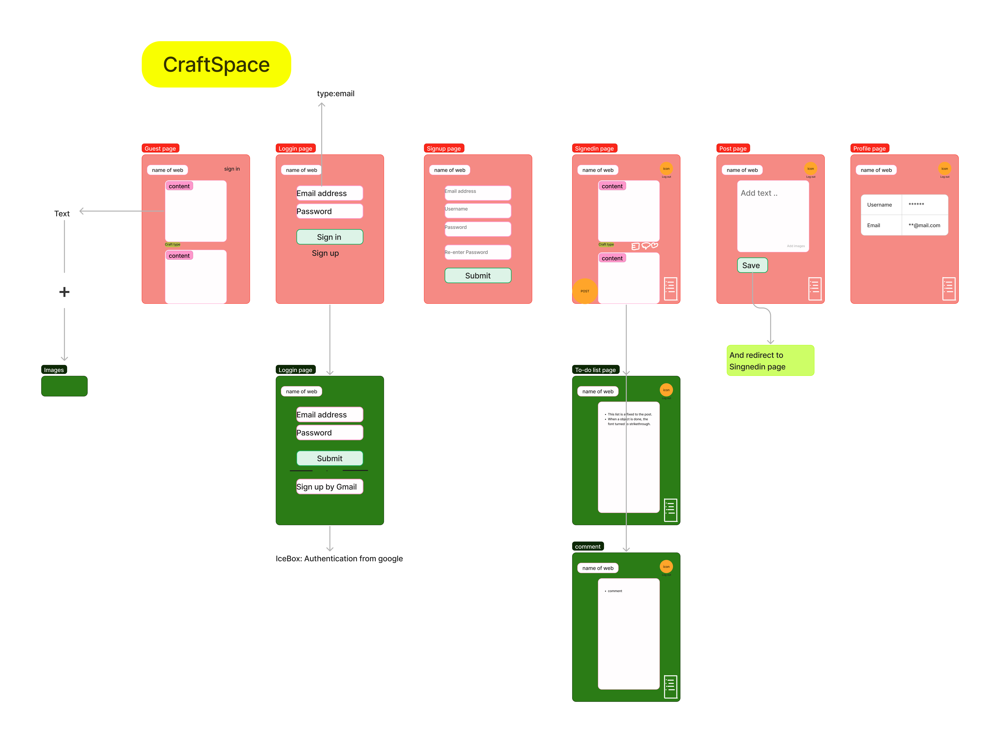
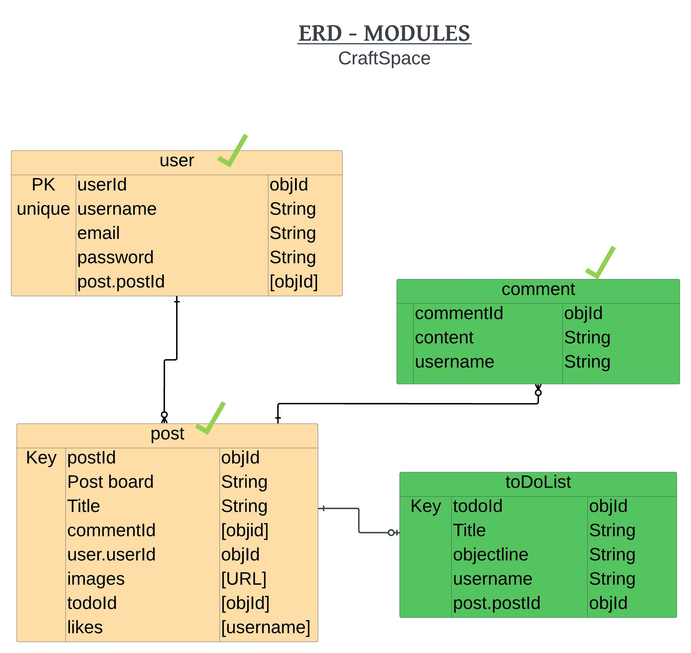

# CraftSpace
I want to build a website to share craft images or skills.

# Basic structure of Website

# MVP Goals

1. As a guest, I should be able to see all the content when I go to the home page.

2. As a guest, I should be able to sign up so that I can use the features such as like, comment, add a list.

3. As a user, I should be able to view profile.

4. As a user, I should be able to make a post with images and texts.

# Trello board

https://trello.com/b/2Y0xbNRU/unit-project-2

# ERD

