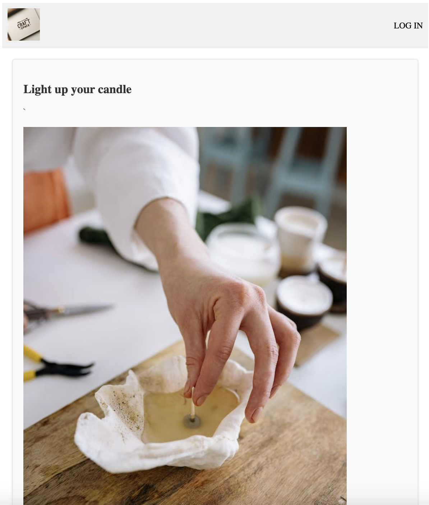
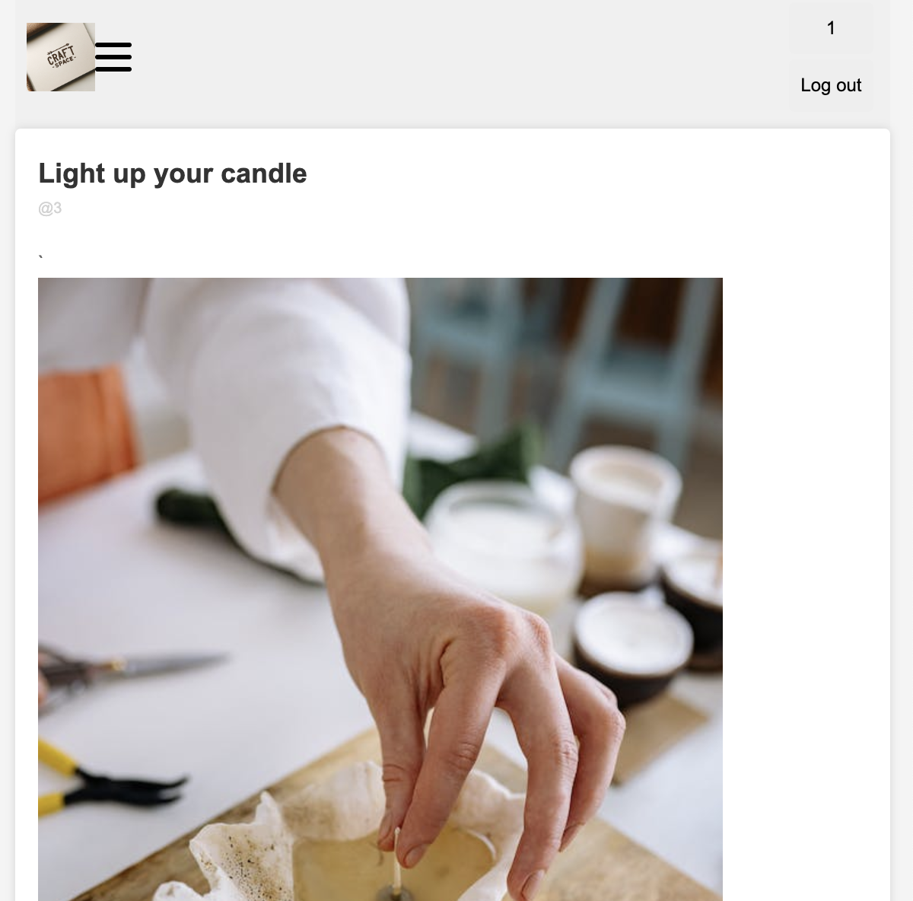

# CraftSpace
I want to build a website to share craft images or skills.

# Basic structure of Website
Design:

Result:

# My App: Craft Space 
Front end link:
https://vercel.com/shans-projects-620d094c/craft-space-front-end

# Techniques
Node.js, Express, html, css, JWT authentication

# MVP Goals

1. As a guest, you are able to see the latest 5 posts when you go to the landing page.

2. As a guest, you are able to sign up so that you can use the features such as like, comment, add a post.

3. As a user, you are able to login and view your profile.

4. As a user, you are able to make a post with images and texts.

# Trello board

https://trello.com/b/2Y0xbNRU/unit-project-2

# ERD

# Route table
|  Route         |       Request|
|-------|-------|
|./     |GET |
|/login  | POST|
|/signup  | POST
|/user| GET|
|/user/:id | GET PUT DELETE|
|/user/post | GET POST|
|/user/post/:id | GET PUT DELETE
|||
|/post/comment | GET POST
|/post/comment/:id | GET PUT DELETE
|||
|/post/todo | GET POST (undone)|
|/post/todo/:id | GET PUT DELETE(undone)|

# Next goal
1. Upload images from local by multer
2. Add todo list 
3. Give standard size to each post container in all pages except in the single post page.
4. Add likes list
5. Add follower list

# Thank you
Fritz, Lesley, Kia, Stephen, Kenneth

